# LIP READING: TO BUILD A MODEL FOR IMPLEMENTING AUTOMATED LIP READING TECHNIQUE WHICH INVOLVES LIP MOTION FEATURE TO TEXT CONVERSION
A speech recognition system has three major components: feature extraction, probabilistic modelling of features and classification. The general approach is to extract the principal components of the lip movement in terms of the lip shape based properties in order to establish a correspondence between alphabets and the lip shape. Several classification aspects for speech reading are compared to come up with a faster algorithm to implement the proposed problem statement. 
# INTRODUCTION
Sounds are rhythmic nodes created by vocal cords. Each human being has an individual pattern which can discriminate him/her from others. In the case of imitation also an individual likes to reproduce a pattern of sound which other person produces with easy. In the present work, we want to understand the pattern in which an individual creates a sound for expressing a specific letter. Further, a standard pattern is created which will be knowledge base for the comparison of the expressed sound with the knowledge base. Sounds can be made with the lips in the same position. Fast speech, poor pronunciation, bad lighting, face turning away, hands over mouths, moustaches and beards make lip reading more difficult or even impossible. The concept of image matching is taken up to understand the expressed sound which makes it a unique process since it is an understood parameter that irrespective of the individual's vocal cord the movement of lips has to be same to for pronouncing the letters. This idea has been taken in the present project to bring out the different patterns for the pronunciation. 
# EXISTING TECHNOLOGY
As there will be illumination variation during the process of talking a few of them talk slowly few speak loudly, Hence there will be a difference in the lip motion or movements. A lot of research work is being done on lip-reading competing speaker, the challenge of multispeaker, presence and absence of lipstick and moustache, front view lipreading.  Many techniques have been proposed for lip-reading. Different methods are used to extract features.  Many features related to characters were studied and recognition techniques based on those features were suggested.  
In this project, we are going to convert lip motion features to text conversion wherein the input is the static images or real-time videos from which we are going to To build a model for implementing automated lip reading which involves Lip motion feature to text conversion we extract frames from these videos and contour the region for lip extraction from which we get the output as text. The present work is concerned with designing a system to determine the letter spoken by the speaker using a video consisting of lip movements. The solution proposed in this work is to determine vowels of English language spoken by many speakers but of the same region. To provide a tool for deaf and dumb people for better communication.
# OBJECTIVE
This project aims at tracking the lip region based on colour and shape information. This project begins with the videos being shot focused basically to the lip area. The video thus obtained will be segmented to frames which are used for designing and implementing the experimental models. Further, the extracted images will be processed using MATLAB to correlate every lip image to its equivalent syllable. The final output of this system is the text display of the alphabet spoken by the speaker.  The experimental results have been tested on different frames under constraints of illumination condition and head motion. 
# DATASET
### This image represents the lip shape for letter: A
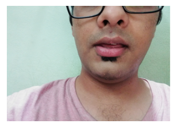 
### This image represents the lip shape for letter: E
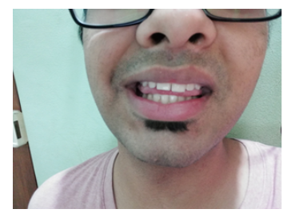 
### This image represents the lip shape for letter: I
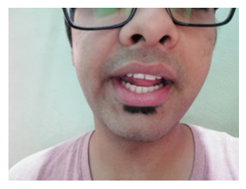 
### This image represents the lip shape for letter: O
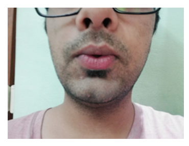 
### This image represents the lip shape for letter: U
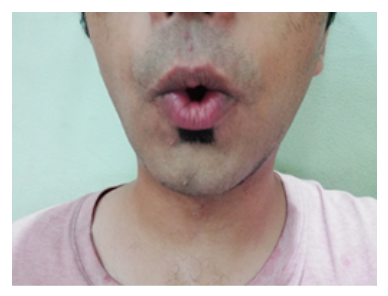 
# IMAGE PREPROCESSING
This is a working implementation of bounding box which is done by applying various filters to the suitable image and applying Image enhancement using histogram equalization. 
 
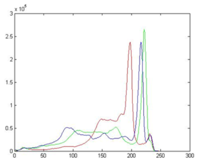 
This is the sample image we have taken for the character ‘A’ focusing mainly on the mouth region and accordingly plotted a graph. 
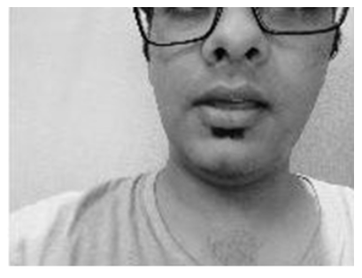 
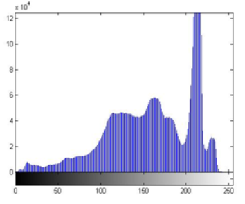 
Conversion of the sample image(rgb) to gray scale so as to perform all the suitable conversion as required by our algorithm and hence plotting its intensity graph. 
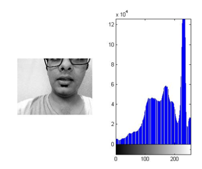 
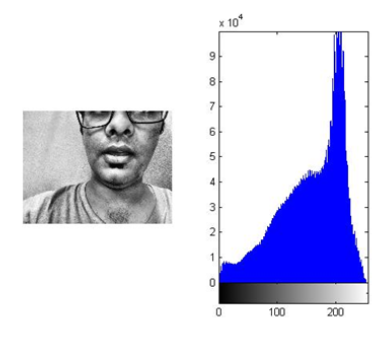 
These are the equalizations we have performed on the sample grayscale image that we have rejected because the large variations in the values of the graph(pixel vs intensity) makes the detection difficult and hence makes the result hard to determine.  
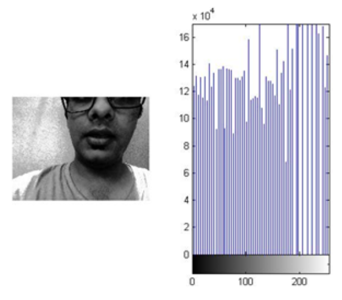 
The Contrast enhancement technique proves to be the most suitable for our project as you can see the histogram is modified to have the counts of all pixels close to each other (uniform distribution).  
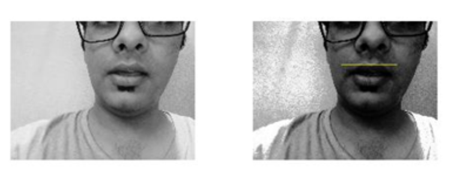 
Notice how we can observe that the contrast of the image is improved visually(notice how the features of the face "stands out" more in the histogram equalized image). Hence, we achieved the suitable contrast scheme for further processing.  
# WORK DONE
To start with, a database of images of various syllables (lip region extraction) was first created by extracting frames from a captured video. The video is captured so as to focus on the lip movement information. The video is taken under certain standardized conditions such as uniform illumination, steady face alignment. The images obtained were further used to train a lip detecting classifier by supplying positive and negative images.   
Following this, a number of equalization techniques (imhist, imadjust, adapthisteq) were implemented out of which the best result was chosen to proceed with. Once we accomplished image equalization, the lip region was extracted using the aforementioned trained classifier. This resulted in all the input frames being enclosed by a bounding box surrounding the lip region.   
Use of hypothesis testing in lip reading technique improves the accuracy rate. In this technique, the problem is divided into three different parameters: height, width and area viz. Height (vertical distance between upper and lower lip points), Width (horizontal distance between outer lip points), Area (area of the lip region). This study used trained a classifier in lip reading applications and its approach based on the most commonly used words making the search and processing faster and more accurate as compared to traditional image comparison techniques. This study also compares the similar sounding words.   
To build a model for implementing automated lip reading which involves Lip motion feature to text conversion, differentiating data into different parameter deals with the problem of classifying a set of N objects into groups so that objects within the same group are more similar than objects belonging to different groups. 
# RESULTS AND DISCUSSION
We analysed the lip motion feature by giving various images of lips and finding their lip properties such as form factor, area, horizontal distance, vertical distance, up and down angles as input. The output is measured in terms of the class value and associated with the class value the vowels are displayed. 
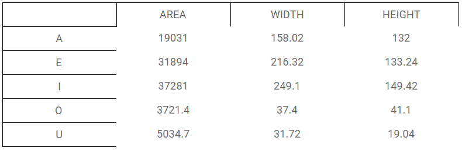 
### Mean graphs for width and height
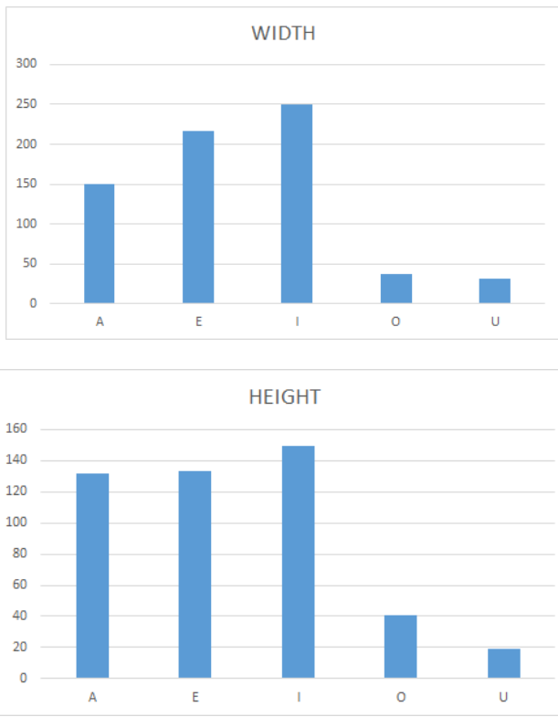 
### Standard deviation graphs for width and height
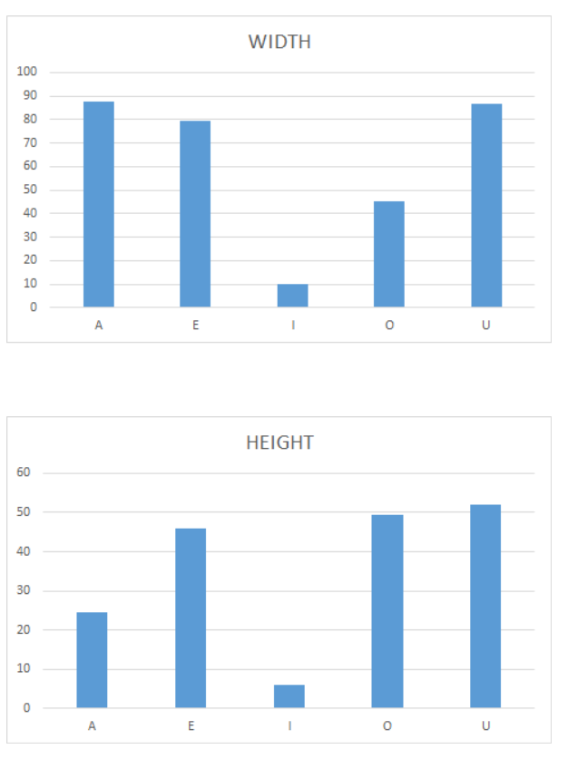 
# CONCLUSION
### This is a plot of mean areas for different vowels
 
### This is a plot of standard deviation in areas for different vowels
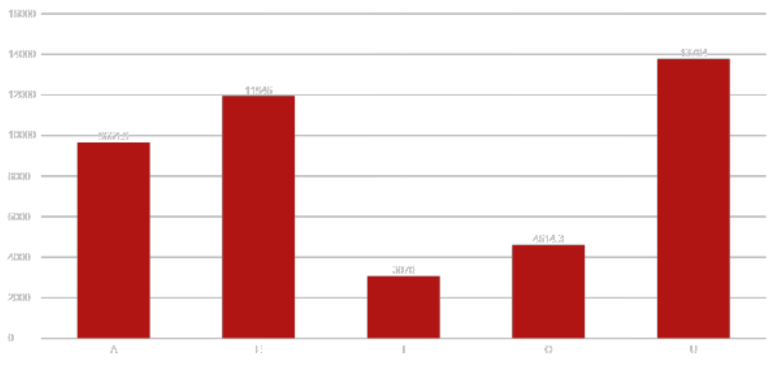 
We were able to differentiate between the vowels that is A,E,I,O,U but failed to differentiate between other letters because it involves processing the tongue movement. Like K and A have similar lip movement.  
So the conclusion we make from the graphs is that for proper and correct functioning of algorithm values should have adequate difference between them so as to make the correct identification of letters possible.  
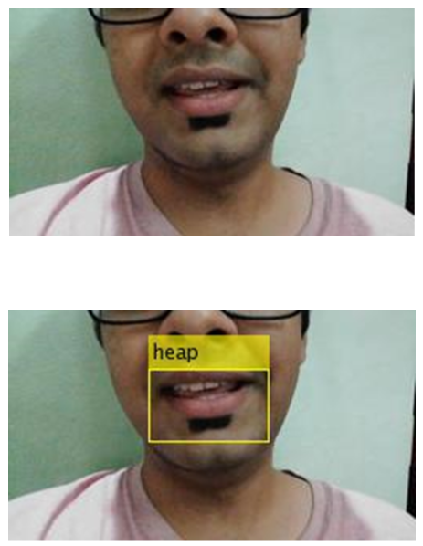 
This is a before and after comparison of the same image (focusing mainly on the mouth area) after applying the Lip Reading algorithm and hence it highlights the lip region and creates a bounding box around it and also identifies the word spoken by the user which is ‘HEAP’ in this case. 
In this project, we have investigated different image enhancement algorithms to detect lip shape from a video frame. We created a database for different shapes of the lip for respective vowels. We trained our model to detect different shapes for lip dimension extraction. 
We calculated statistical data for vowels and used that data to detect lip motion and read lip movement from the input video. The prediction is based on hypothesis testing for a particular frame and statistical data extracted from the database. We were successfully able to detect lip motion of vowels. We were able to differentiate between words like Heap, Eye, Food etc.  
The present project could be more appropriate in case of deaf people, on one hand, are unable to adhere to the voices, while on the other hand, the dumb people fail to effectively express themselves owing to their vocal disability. Hence, we can aid the deaf and dumb by providing them with a device which does not involve voice but only lip motion and hence eases the communication.  
# SCOPE OF FUTURE WORK
Though this work recognizes the vowels well enough, there are plenty of space to improve the recognition accuracy. In future the accuracy can be increased by using some other features and English phonemes or visemes can be identified following this method or it can be used to recognize a word or sentence. Lip segmentation can be improved by Recognition of vowels from facial images using lip reading Technique School of introducing geometric or color based automatic lip segmentation in future. This method can be improved from speaker and language dependent to speaker independent lip-reading system. In future we can work with:  
> All 26 alphabets and numbers, words  
> Robust image registration  
> Product to aid deaf and dumb

